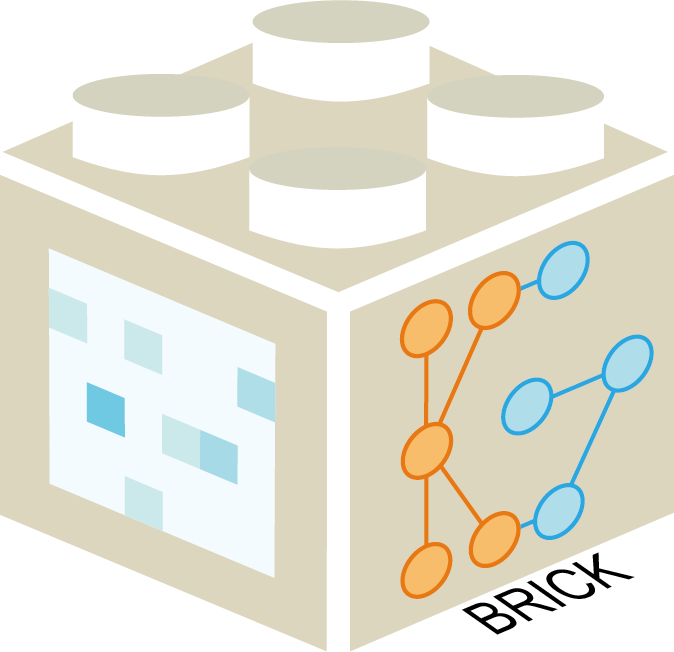
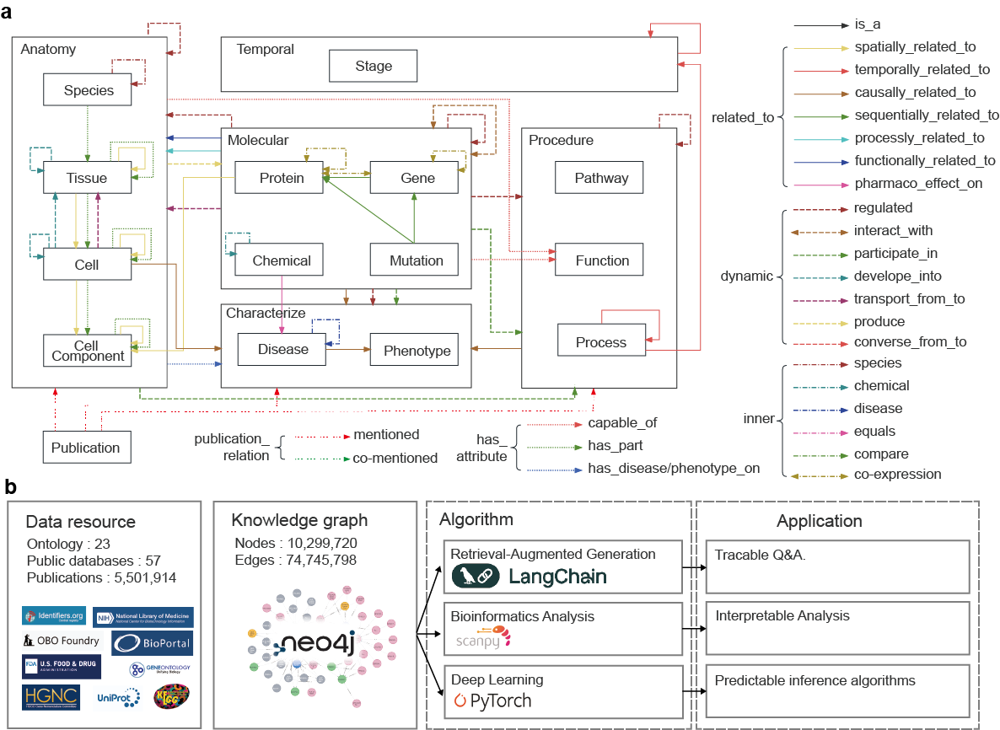

# BRICK

 **B**road, **R**econfigurable and **I**nterpretable framework for **C**ell-omics analysis via **K**nowledge graph

## Schema for the Knowledge Graph

## Main Purpose

We aims to interpret  the analysis result of Cell-omics data analysis. With a comprehensive Knowledge Graph, we can indicated the new discovery under analysis and thus enhance the depth of  research.

## Installation

## Citing

