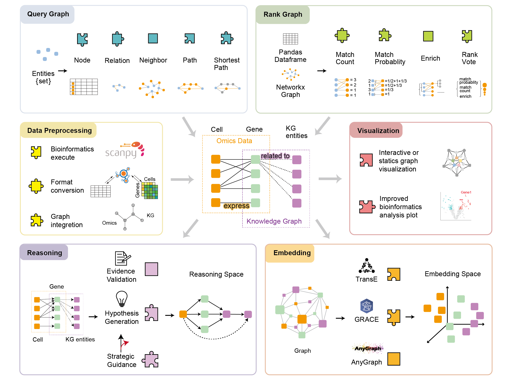

# BRICK

 **B**road, **R**econfigurable and **I**nterpretable framework for **C**ell-omics analysis via **K**nowledge graph


## Schema for the Knowledge Graph




## Main Purpose

We aims to interpret the analysis result of Cell-omics data analysis. Thus, we proposed **BiOmics-BRICK**, a novel and custom-engineered toolchain that unifies fragmented interpretive utilities into a seamless reasoning-to-prediction interface.

BiOmics-BRICK offers a modular, pluggable toolchain to overcome bioinformatic interoperability bottlenecks. BiOmics-BRICK is composed of six pluggable tool modules: Data Preprocessing, Querying, Ranking, Reasoning, Representation Learning (Embedding), and Visualization. The Agent assembles tools from each module on demand according to user needs, forming an end-to-end pipeline that couples omics analysis results with prior knowledge in the knowledge graph in real-time, efficiently distilling key information and potential biological discoveries. The specific modules are:
- Data Processing Module: Implements format conversion between omics data and queried knowledge results, data preprocessing, construct unified sub-graph, and autonomous bioinformatic execution.
- Query Module: Responsible for diversified retrieval of associated entities, relations, neighbor nodes, and paths in the graph using differential expressed genes, variant sites, or protein nodes as anchors.
- Ranking Module: Filters and recommends candidate results based on statistical significance or prior weights.
- Reasoning Module: Transforms prediction tasks into classification or enrichment problems and construct inference trajectory to recommend potential high-value knowledge.
- Embedding Module: Jointly embeds omics data sub-graph and knowledge sub-graph via graph neural networks, achieving association prediction by completing unknown relationships in the joint graph.
- Visualization Module: Reconstructs key visualizations of analysis results, achieving intuitive and simultaneous presentation of data itself and knowledge interpretation results.


## Related work

BRICK is a crucial part of **BiOmics**, A Foundational Bio-Reasoning Agent for Traceable and Mechanistic Multi-omics Discovery. Visit https://github.com/BGIResearch/BiOmics for complete infomation.


## Citing
```bibtex
@article {Cao2026.01.17.699830,
	author = {Cao, Lei and Li, Yuntain and Qin, Hua and Shang, Yanbang and Zhang, Yilin and Jovanovic, Bogdan and Djokic, Lazar and Xia, Tianyi and Hu, Luni and Hou, Haiyang and Ning, Xingxing and Lin, Li{\textquoteright}ang and Qiu, Hao and Deng, Ziqing and Li, Yuxiang and Zhang, Yong and Fang, Shuangsang},
	title = {BiOmics: A Foundational Agent for Grounded and Autonomous Multi-omics Interpretation},
	elocation-id = {2026.01.17.699830},
	year = {2026},
	doi = {10.64898/2026.01.17.699830},
	publisher = {Cold Spring Harbor Laboratory},
	abstract = {While AI has automated bioinformatic workflows, biological interpretation remains fragmented and often disconnected from mechanistic insights. Existing AI is bifurcated between statistical {\textquotedblleft}black-box{\textquotedblright} models that lack logical grounding and simple agents restricted to shallow knowledge retrieval. To bridge this divide, we introduce BiOmics, a foundational agent that synthesizes multi-omics data with adaptive knowledge for biological interpretation. BiOmics introduces a novel dual-track architecture comprising a harmonized explicit reasoning space for grounded logic and a unified latent embedding space for high-dimensional association mapping. This architecture enables a transformative {\textquotedblleft}Retrieving-Reasoning-Predicting{\textquotedblright} paradigm for purposeful, cross-scale inference traversing the biological hierarchy, from molecular variants to disease phenotypes. Empirical evaluations demonstrate that BiOmics surpasses state-of-the-art AI agents and specialized algorithms, markedly augmenting the granularity and depth of biological insights. Specifically, BiOmics exhibits unique superiority in uncovering indirect pathogenic variants, achieving reference-free cell annotation, and prioritizing drug repurposing candidates tailored to specific datasets. BiOmics further enriches the interpretive landscape of biological entities, leveraging its reasoning-grounded knowledge graph to uncover deep functional contexts. Ultimately, BiOmics provides a versatile engineering foundation to transition AI for Science from descriptive {\textquotedblleft}data fitting{\textquotedblright} to autonomous, knowledge-driven interpretation.Competing Interest StatementThe authors have declared no competing interest.National Natural Science Foundation of China, 32300526},
	URL = {https://www.biorxiv.org/content/early/2026/01/20/2026.01.17.699830},
	eprint = {https://www.biorxiv.org/content/early/2026/01/20/2026.01.17.699830.full.pdf},
	journal = {bioRxiv}
}
```


